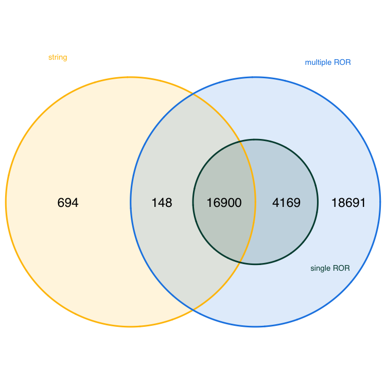

::: {.callout-note}
Dieses Notebook wird nur auf Englisch angeboten
:::

# Introduction

In one of the [notebooks](https://oa-datenpraxis.de/OpenAlex.html) we have published, we outlined how library and information professionals can use OpenAlex for monitoring the Open Access publication output at their institution. That notebook uses ROR IDs to identify publications of the institution in OpenAlex. However, this approach has limitations. In this notebook, we want to explore the case of institutions associated with multiple ROR IDs and the potential matching problems that can arise when using a ROR ID-based search strategy.

[ROR IDs](https://scholarlykitchen.sspnet.org/2019/12/04/are-you-ready-to-ror-an-inside-look-at-this-new-organization-identifier-registry/) are persistent identifiers for research organizations. As such, they uniquely identify organizations with each ROR record gathering name variants, e.g. language variants or acronyms (see for example the ROR record of the [University of Göttingen](https://ror.org/01y9bpm73)). A ROR-based search strategy thus brings the advantage that the search is less prone to be affected by spelling variants or errors of organizational names. In contrast, a string-based search strategy can more likely result in false positives, e.g. when searching for [display names](https://docs.ropensci.org/openalexR/articles/institution.html). Furthermore, ROR IDs are strongly integrated into OpenAlex, as all [institutions in OpenAlex](https://docs.openalex.org/api-entities/institutions) are assigned ROR IDs.

Sometimes, a research institution can comprise multiple entities that are assigned individual ROR IDs. Examples include a university and the university hospital, graduate school or individual institutes.
In ROR, this is addressed by relationship types that express connections between related ROR IDs. The [ROR metadata schema](https://ror.readme.io/docs/ror-data-structure) defines these relationship types:

-   **parent / child**: “Parent / child relationships indicate a relationship where the parent exercises control (supervisory, administrative, or financial) over the child, or the child is a component of the parent entity, like a research center within a university.”

-   **related**: “The related relationship type denotes less defined connections, such as resource sharing or participation without direct control.”

-   **predecessor / successor**: “Successor and predecessor relationships track organizational continuity and are used when an entity ceases operations or to redirect from erroneous records to correct ones.”

In this notebook, we want to explore how the inclusion / exclusion of related ROR IDs impact results when searching for publications of an institution. 


# Comparing search strategies

We focus on the case of [Humboldt-Universität zu Berlin](https://ror.org/01hcx6992) and [Charité -- Universitätsmedizin Berlin](https://ror.org/001w7jn25), the joint university hospital of Humboldt-Universität zu Berlin and Freie Universität Berlin. Although Charité is operationally and academically closely linked to Humboldt-Universität zu Berlin, ROR classifies their relationship as "related", not "parent/child." This distinction is critical: unlike a university department or research center (which would be a child), a "related" institution is not automatically included in a search for its partner. As a result, excluding Charité’s ROR ID from a search may lead to undercounting publications from the broader institutional ecosystem -- a key challenge for accurate institutional monitoring.

## Loading packages

We will load the *openalexR* package [@openalexR] that allows us to query the OpenAlex API and the *tidyverse* package [@tidyverse] that provides a lot of additional functionalities for data wrangling and visualization. Additionally, we will load the *arsenal* package [@arsenal] to compare data frames, the *VennDiagram* package [@venn] to visualize data as Venn diagrams and the *DT* package [@DT] to create interactive HTML tables from tabular outputs.

```{r}
library(tidyverse)
library(openalexR)
library(arsenal)
library(VennDiagram)
library(DT)
```

## ROR-based search

For the ROR-based search strategy, we will query the OpenAlex API twice. Once, using both ROR IDs for Humboldt-Universität zu Berlin and Charité -- Universitätsmedizin Berlin and once using only the single ROR ID for Humboldt-Universität zu Berlin. All other parameters are set to be identical. To query the API we use the `oa_fetch` function from the openalexR package and store each returned data frame into an R object (*df1* and *df2*, respectively). 


```{r, eval=FALSE}
df1 <- oa_fetch(entity = "works", 
               institutions.ror = c("01hcx6992", "001w7jn25"), # change the ROR ids if you want to analyse the performance of other institutions
               type = "article",
               is_paratext = FALSE,
               is_retracted = FALSE,
               from_publication_date = "2020-01-01",
               to_publication_date = "2024-12-31",
               options = list(select = c("doi","authorships","publication_year")),
               output = "tibble", 
               paging = "cursor",
               abstract = FALSE,
               api_key = "your_api_key") # add your api key here
```

```{r, eval=FALSE}
df2 <- oa_fetch(entity = "works", 
               institutions.ror = "01hcx6992", # change the ROR id if you want to analyse the performance of another institution
               type = "article",
               is_paratext = FALSE,
               is_retracted = FALSE,
               from_publication_date = "2020-01-01",
               to_publication_date = "2024-12-31",
               options = list(select = c("doi","authorships","publication_year")),
               output = "tibble", 
               paging = "cursor",
               abstract = FALSE,
               api_key = "your_api_key") # add your api key here
```

## String-based search

For the string-based search strategy, we will query the OpenAlex API once using the string "Humboldt-Universität zu Berlin". To query the API we again use the `oa_fetch` function from the openalexR package and store the returned data frame into the R object *df3*. All other parameters are identical to the ROR-based searches.


```{r, eval=FALSE}
df3 <- oa_fetch(entity = "works", 
               raw_affiliation_strings.search = "Humboldt-Universität zu Berlin", # change the affiliation name if you want to analyse the performance of another institution
               type = "article",
               is_paratext = FALSE,
               is_retracted = FALSE,
               from_publication_date = "2020-01-01",
               to_publication_date = "2024-12-31",
               options = list(select = c("doi","authorships","publication_year")),
               output = "tibble", 
               paging = "cursor",
               abstract = FALSE,
               api_key = "your_api_key") # add your api key here
```

```{r}
#| eval: false
#| echo: false

saveRDS(df1, file = "df1.rds")
saveRDS(df2, file = "df2.rds")
saveRDS(df3, file = "df3.rds")
```

## DOI overlap

```{r}
#| echo: false

df1 <- readRDS(file = "notebooks/df1.rds")
df2 <- readRDS(file = "notebooks/df2.rds")
df3 <- readRDS(file = "notebooks/df3.rds")
```

To explore the impact of our different search strategies on the composition of the resulting data frames, we will first analyse the size of each data frame determined by the number of distinct DOIs using the `n_distinct` function.

```{r}
#| echo: false
df1 <- df1 |> 
  filter(!is.na(doi)) |> 
  distinct(doi, .keep_all = TRUE)

df2 <- df2 |> 
  filter(!is.na(doi)) |> 
  distinct(doi, .keep_all = TRUE)

df3 <- df3 |> 
  filter(!is.na(doi)) |> 
  distinct(doi, .keep_all = TRUE)
```


```{r}
n_distinct(df1$doi)
n_distinct(df2$doi)
n_distinct(df3$doi)
```

The output shows that the ROR-based search strategies result in data frames (*df1* and *df2*) with more entries than the string-based search strategy (*df3*). This result might be expected, since the first ROR-based strategy explicitly searched for publications from two institutions. Interestingly, however, the string-based search strategy and the ROR-based search strategy with the single ROR (*df2*) result in a different number of publications, although it might be expected that the numbers would be the same, given that searches explicitly focused on publications from Humboldt-Universität zu Berlin. 

To get insight into how many observations, i.e. publications, the data frames share, we will perform pairwise comparisons of the data frames using the `comparedf` function from the arsenal package.

```{r}
comparedf(df1, df2, by = "doi")
```

For the comparison of *df1* and *df2*, the output shows that both data frames share all variables and 21,069 publications, which is precisely the number of publications in our *df2* data frame. This is to be expected, because the search strategy resulting in *df1* includes the search strategy resulting in *df2*. Therefore, we might assume that the 18,839 publications in *df1* that are not included in *df2* can be attributed to Charité. We will investigate if this is the case in the next section.

```{r}
comparedf(df1, df3, by = "doi")
```

The comparison of *df1* and *df3* shows that both data frames share all variables and 17,048 publications. The total size of *df3* is 17,742, therefore, the string-based search strategy adds only a limited number of publications. However, it is important to note that we applied a broader search strategy (using ROR IDs of both the university and the university hospital) to obtain *df1*, whereas we only searched for "Humboldt-Universität zu Berlin" for *df3*.

```{r}
comparedf(df2, df3, by = "doi")
```

Comparing *df2* and *df3* shows that both data frames share all variables and 16,900 publications. The number of publications not shared by both data frames is 5,011. We will investigate the cause further in the next section.

Additionally to the pairwise comparison, the following Venn diagram aims to visualise the DOI overlap of all three data frames at the same time. To create the diagram we us the `venn.diagram` function from the VennDiagram package.

```{r, eval = FALSE}
venn.diagram(
  x = list(df1$doi, df2$doi, df3$doi),
  category.names = c("multiple ROR" , "single ROR" , "string"),
  filename = 'doi_venn_diagram.png',
  output=TRUE,
          imagetype="png" ,
          height = 750 , 
          width = 750 , 
          resolution = 300,
          compression = "lzw",
          lwd = 1,
          col=c("#1E88E5", '#004D40', '#FFC107'),
          fill = c(alpha("#1E88E5",0.3), alpha('#004D40',0.3), alpha('#FFC107',0.3)),
          cex = 0.5,
          fontfamily = "sans",
          cat.cex = 0.3,
          cat.default.pos = "outer",
          cat.pos = c(-27, 27, 130),
          cat.dist = c(0.085, 0.085, 0.085),
          cat.fontfamily = "sans",
          cat.col = c("#1E88E5", '#004D40', '#FFC107'),
          rotation = 1
)
```



The Venn diagram reveals that *df2* (single ROR) is fully contained within *df1* (multiple RORs). Furthermore, the diagram shows that 18,691 publications are unique to *df1* — these are likely attributable to Charité – Universitätsmedizin Berlin, as they are not found in either the single-ROR or string-based searches. 694 publications are unique to *df3* (string-based search), i.e. these are not captured by either ROR-based approach.

## Set differences

To understand the real-world implications of the differences between our three data frames — especially the 18,691 publications unique to *df1* and the 694 unique to *df3* — we now examine the affiliation data behind these sets. This analysis helps to understand if our assumptions are correct and the unique publications in *df1* are truly from Charité – Universitätsmedizin Berlin and the unique publications in *df3* are affiliated with Humboldt-Universität zu Berlin. 

To this end, we use the `anti_join` function from the tidyverse package to partition the datasets into non-overlapping groups, isolating publications that are unique to each strategy. We nest two `anti_join` functions to create *df1_unique*, which includes publications that are unique to *df1*, and a single `anti_join` function to create *df3_unique*.

```{r}
df1_unique <- anti_join(anti_join(df1, df3, by = "doi"), df2, by = "doi")
df3_unique <- anti_join(df3, df1, by = "doi")
```

We begin by exploring the affiliation records of the 18,691 publications in *df1_unique*. To do this, we need to unnest the *authorships* column to access affiliation data, because publications can have multiple authors that are affiliated with different institutions. Then, we will find all affiliations that contain the string "Berlin" and count the number of times each institution appears in the data frame.

```{r}
df1_unique |> 
  select(authorships, doi) |> 
  unnest(authorships) |> 
  unnest(affiliations, names_sep = "_") |> 
  select(doi, affiliations_display_name, affiliation_raw) |> 
  filter(str_detect(affiliations_display_name, "Berlin")) |> 
  group_by(affiliations_display_name) |> 
  summarise(n = n()) |> 
  arrange(desc(n)) |> 
  datatable()
```

The output shows that the most common affiliation in *df1_unique* is Charité - Universitätsmedizin Berlin. Notably, Humboldt-Universität zu Berlin does not appear as an affiliation string in any of these publications. This provides strong evidence that publications unique to *df1* are introduced by the inclusion of Charité’s ROR ID in the search. The second most common affiliation listed is the [Berlin Instiute of Health](https://ror.org/0493xsw21), a child organization of Charité with a separate ROR ID.

Next, we want to confirm that all 18,691 publications in *df1_unique* are genuinely affiliated with Charité. We filter for the exact display name "Charité – Universitätsmedizin Berlin", count the number of distinct DOIs in the filtered set, and compare it to the number of publications *df1_unique*.

```{r}
n_distinct(df1_unique$doi)

df1_unique |> 
  select(authorships, doi) |> 
  unnest(authorships) |> 
  unnest(affiliations, names_sep = "_") |> 
  select(doi, affiliations_display_name, affiliation_raw) |> 
  filter(str_detect(affiliations_display_name, "Charité - Universitätsmedizin Berlin")) |> 
  summarise(n_doi = n_distinct(doi)) |> 
  pull(n_doi)
```

The output shows that the counts are identical. This means that each of the 18,691 publications in *df1_unique* has Charité listed at least once as an affiliation, confirming that the publications unique to *df1* are truly from Charité.

Since *df2* is a proper subset of *df1*, we will now explore the affiliation records for all publications of *df2*. The analysis steps are the same as for *df1_unique*: we unnest authorship data, extract affiliations, and count.

```{r}
df2 |> 
  select(authorships, doi) |> 
  unnest(authorships) |> 
  unnest(affiliations, names_sep = "_") |> 
  select(doi, affiliations_display_name, affiliation_raw) |> 
  filter(str_detect(affiliations_display_name, "Berlin")) |> 
  group_by(affiliations_display_name) |> 
  summarise(n = n()) |> 
  arrange(desc(n)) |> 
  datatable()
```

The output shows that the most common affiliation listed for publications in *df2* is Humboldt-Universität zu Berlin. Notably, Charité - Universitätsmedizin Berlin is the second most common affiliation. This indicates that the publications in *df2* are attributable to the inclusion of the ROR ID of Humboldt-Universität zu Berlin in the search. The strong representation of Charité in *df2* could indicate that many publications involve co-authorship with Charité.

To confirm that all publications in *df2* are genuinely affiliated with the university, we filter for the exact display name "Humboldt-Universität zu Berlin", count the number of distinct DOIs in the filtered set, and compare it to the number of publications in *df2*. Additionally, we filter for the display name "Charité – Universitätsmedizin Berlin" and compare the count of distinct DOIs to check how many publications might be the result of collaboration between both institutions.

```{r}
n_distinct(df2$doi)

df2 |> 
  select(authorships, doi) |> 
  unnest(authorships) |> 
  unnest(affiliations, names_sep = "_") |> 
  select(doi, affiliations_display_name, affiliation_raw) |> 
  filter(str_detect(affiliations_display_name, "Humboldt-Universität zu Berlin")) |> 
  summarise(n_doi = n_distinct(doi)) |> 
  pull(n_doi)

df2 |> 
  select(authorships, doi) |> 
  unnest(authorships) |> 
  unnest(affiliations, names_sep = "_") |> 
  select(doi, affiliations_display_name, affiliation_raw) |> 
  filter(str_detect(affiliations_display_name, "Charité - Universitätsmedizin Berlin")) |> 
  summarise(n_doi = n_distinct(doi)) |> 
  pull(n_doi)
```

The output shows that all publications are genuienly affiliated with Humboldt-Universität zu Berlin. `r round(9164 / 21069, 2)` % of publications originated from co-authorship of Humboldt-Universität zu Berlin and Charité. 

Finally, we repeat the analysis of affiliations for the 694 publications in *df3_unique*. The steps are the same as for before: we unnest authorship data, extract affiliations, and count.

```{r}
df3_unique |> 
  select(authorships, doi) |> 
  unnest(authorships) |> 
  unnest(affiliations, names_sep = "_") |> 
  select(doi, affiliations_display_name, affiliation_raw) |> 
  filter(str_detect(affiliations_display_name, "Berlin")) |> 
  group_by(affiliations_display_name) |> 
  summarise(n = n()) |> 
  arrange(desc(n)) |> 
  datatable()
```

The results show that neither Humboldt-Universität zu Berlin nor Charité – Universitätsmedizin Berlin appear as affiliations in any of the 694 publications unique to *df3*. Instead, the Berlin Institute of Health (BIH) — a child institution of Charité — is the most frequently listed affiliation. Since *df3* results from a string-based search for "Humboldt-Universität zu Berlin" in raw affiliation strings, we now investigate why these publications were included — particularly those listing BIH as an affiliation. This helps us determine whether the string-based search is capturing legitimate publications from Humboldt-Universität zu Berlin or generating false positives due to ambiguous or overlapping names.

To assess the extent of this issue, we first determine how many of the 694 publications in *df3_unique* list Berlin Institute of Health as an affiliation.

```{r}
n_distinct(df3_unique$doi)

df3_unique |> 
  select(authorships, doi) |> 
  unnest(authorships) |> 
  unnest(affiliations, names_sep = "_") |> 
  select(doi, affiliations_display_name, affiliation_raw) |> 
  filter(str_detect(affiliations_display_name, "Berlin Institute of Health at Charité - Universitätsmedizin Berlin")) |> 
  summarise(n_doi = n_distinct(doi)) |> 
  pull(n_doi)
```

While BIH is the most common affiliation, it appears in only a small fraction of the unique *df3* publications. This suggests that most of the 694 publications were included due to other reasons — for example because they include the string "Berlin".


To understand why these 694 publications were included in *df3*, we examine the raw affiliation strings for the 44 publications where BIH appears.

```{r}
df3_unique |> 
  select(authorships, doi) |> 
  unnest(authorships) |> 
  unnest(affiliations, names_sep = "_") |> 
  select(doi, affiliations_display_name, affiliation_raw) |> 
  filter(str_detect(affiliations_display_name, "Berlin Institute of Health at Charité - Universitätsmedizin Berlin")) |> 
  datatable()
```

The results reveal two main patterns: Several affiliation strings include "Corporate Member of Freie Universität Berlin, Humboldt-Universität zu Berlin", a phrase that explicitly contains the search term "Humboldt-Universität zu Berlin". Others list only "Berlin" or "Charité – Universitätsmedizin Berlin", which may match the search string due to partial or contextual matching, even though the institution is not Humboldt-Universität zu Berlin.

The `raw_affiliation_strings.search` parameter in OpenAlex does not require an exact match, as stated in the [openalexR package documentation](https://docs.ropensci.org/openalexR/reference/oa_query.html#arg-search). Instead it likely performs fuzzy, substring-based matching, which allows for flexibility but increases the risk of false positives. This indicates that string-based search is prone to false positives, especially when search strings contain common words like "Berlin". Thus, a string-based search strategy can lead to an overestimation of the publication output of institutions.

## Conclusion

The example we examined here demonstrates that search strategies significantly impact results. Using OpenAlex for monitoring the publication output of a research institution has many advantages, but search strategies should be carefully considered before implementation, especially in the case of institutions with child or related entities. Users should determine the entities they want to include or exclude from monitoring activities, and if they want to avoid false positives, they should base the search strategy on ROR IDs. Results should be checked and ideally compared to other bibliographic databases.


# References
