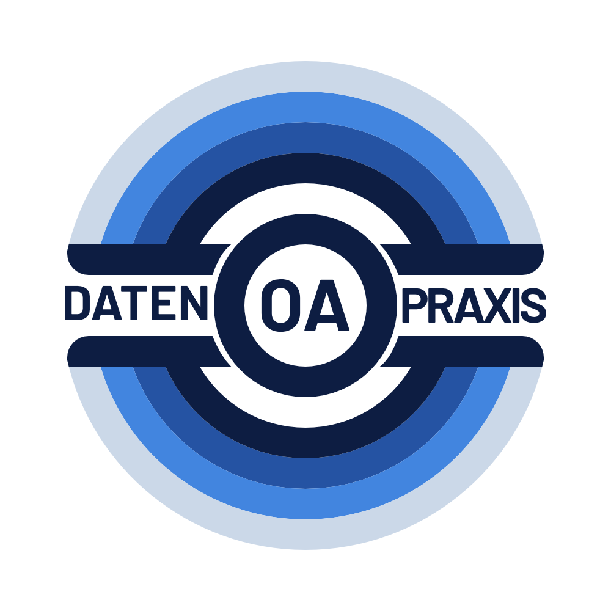

::: {.callout-note}
This resource is only available in German
:::

Die Open-Access-Transformation erfordert eine Umstellung der Finanzierungsstrukturen des wissenschaftlichen Publikationssystems. Damit einher geht auch eine Diversifizierung von Finanzströmen -- der Wissenschaftsrat legte Wissenschaftlichen Einrichtungen darum in der 2022 veröffentlichten [Empfehlungen zur Transformation des wissenschaftlichen Publizierens zu Open Access](https://www.wissenschaftsrat.de/download/2022/9477-22.pdf) nahe, alle informationsbezogenen Ausgaben zu erfassen, orientiert am Konzepts des [Informationsbudgets](https://open-access.network/informieren/glossar#c19015). Ein wesentlicher Bestandteil des Informationsbudgets ist das Publikationskostenmonitoring, bei dem Ausgaben für Publikationen für eine Einrichtung möglichst vollständig erfasst werden.

2025 hat das DFG-geförderte Projekt [Transform2Open](https://www.transform2open.de) die [Empfehlungen zur Gestaltung des institutionellen Publikationskostenmonitorings](https://doi.org/10.5281/zenodo.14748772) veröffentlicht, die auf einen umfassenden Konsultationsprozess aufbauen. Die Handreichung richtet sich an Entscheidungsträger:innen in wissenschaftlichen Einrichtungen in Deutschland und liefert praxisnahe Empfehlungen für die institutionelle Implementierung des Kostenmonitorings.

## Über diese Materialsammlung

Diese Sammlung ist eine gemeinsame Initiative der Projekte [OA Datenpraxis](https://oa-datenpraxis.de) und [Transform2Open](https://www.transform2open.de). Sie wird von OA Datenpraxis koordiniert und ergänzt die Empfehlungen von Transform2Open. Gemeinsam haben wir textbasierte Materialien mit Praxisbezug gesammelt, die den Einstieg in das Thema Publikationskostenmonitoring erleichtern können. Die gesammeldten Materialien sind gegliedert nach den Bereichen aus der Empfehlung von Transform2Open:

- 1 Policy / Agenda Setting
- 2 Interne Kommunikation
- 3 Aufgaben und Ressourcen
- 4 Datensammlung / Datenverarbeitung
- 5 Reporting

[{width=30% style="margin-top: 50px;"}](https://oa-datenpraxis.de)
[{width=45% style="margin-top: 50px;"}](https://www.transform2open.de)

### Wie kann ich zur Materialsammlung beitragen?

Diese Materialsammlung ist als "living document" konzipiert, das kollaborativ gepflegt und erweitert werden kann. Sie können die Sammlung mitgestalten, indem Sie Materialien zur öffentlichen Zotero-Gruppenbibliothek hinzufügen; sie werden dann in der Sammlung der Projektwebseite von OA Datenpraxis ergänzt. Der offenen Zotero-Gruppe können alle Interessierten beitreten ([Link zur Zotero-Gruppe "Materialsammlung institutionelles Publikationskostenmonitoring"](https://www.zotero.org/groups/6574177/materialsammlung_institutionelles_publikationskostenmonitoring)).

## Materialien

### 1 Policy / Agenda Setting

::: {#refs-1-policy}
:::

### 2 Interne Kommunikation

::: {#refs-2-intern}
:::

### 3 Aufgaben und Ressourcen

::: {#refs-3-aufgaben}
:::

### 4 Datensammlung / Datenverarbeitung

::: {#refs-4-daten}
:::

### 5 Reporting

::: {#refs-5-reporing}
:::
